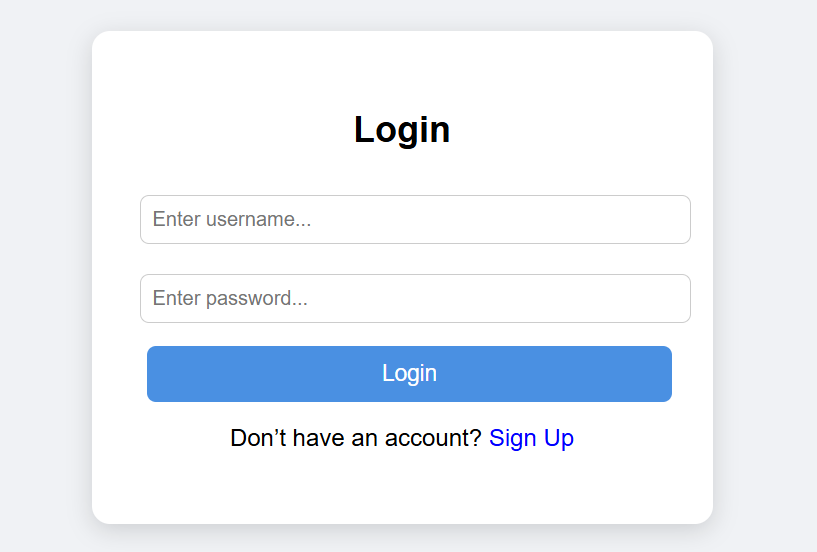
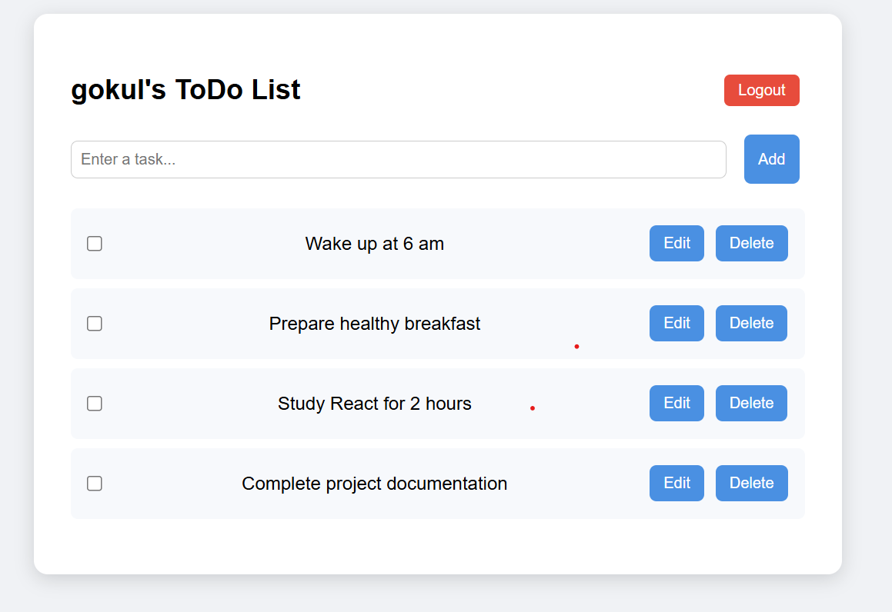

# React + Vite Todo List App

- A simple and user-friendly Todo List application built with React + Vite.  
- Supports login/signup, task management (add, update, check/uncheck, delete), and persistence using LocalStorage.

# Wireframes
- ## Login/Signup page

- ## Todo page

# HTML tags used
- ## Login/Signup page
    - div&nbsp;&nbsp;&nbsp;&nbsp;&nbsp;&nbsp;&nbsp;-> Layout container.
    - h1/ h2&nbsp;-> Heading/Title(e.g., Login).
    - form&nbsp;&nbsp;&nbsp;&nbsp;-> To get the user details.
    - input&nbsp;&nbsp;&nbsp;-> For user name and password fields.
    - button -> For login/sign-up action.
    - p&nbsp;&nbsp;&nbsp;&nbsp;&nbsp;&nbsp;&nbsp;&nbsp;&nbsp;&nbsp;-> For text.

- ## Todo Page
    - div&nbsp;&nbsp;&nbsp;&nbsp;&nbsp;&nbsp;&nbsp;-> Layout container.
    - h1/ h2&nbsp;-> Heading/Title(e.g., My ToDo List).
    - form&nbsp;&nbsp;&nbsp;&nbsp;-> For adding new taks.
    - input&nbsp;&nbsp;&nbsp;-> Text box for entering a task
    - button -> Add/update/delete.
    - ul&nbsp;&nbsp;&nbsp;&nbsp;&nbsp;&nbsp;&nbsp;&nbsp;&nbsp;-> Unordered list to display tasks.
    - li&nbsp;&nbsp;&nbsp;&nbsp;&nbsp;&nbsp;&nbsp;&nbsp;&nbsp;&nbsp;-> Individual task items.
    - input type="checkbox" -> To mark task complete or not.

# Workflow
- ## Login/Signup
    - If the user already signed up:
        - user can enter their name and password. User name and password are validated and redirected to Todo page.
    - If not signed up:
        - The user can create a new account by selecting the sign up button. New user detail is stored in localstorage.

- ## Todo page
    - The application fetches tasks for the signed in user and showed as unordered list.
    - In the Todo page user can,
        - Add task - The user can add new tasks, which are appended to the unordered list.
        - Edit task - The user can edit existing tasks by clicking the edit button.
        - Check/uncheck task - The user can mark tasks as completed or not using the checkbox.
        - Delete task- The user can delete an exising task by clicking the delete button.
- ## Logout 
    - User can logout from the application. 
    - Clears current user session. Redirects back to Login Page.
